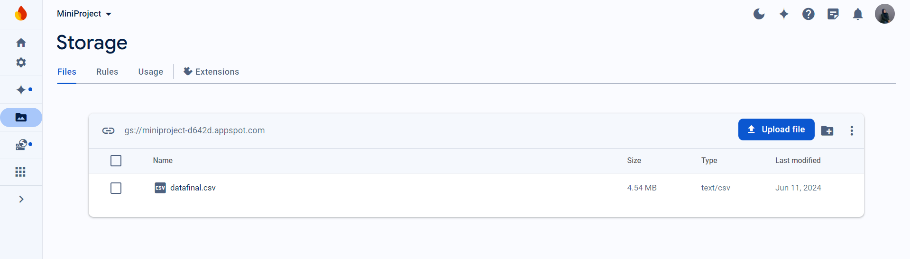

# Mini Project Data Engineer 

<!-- Daftar Isi -->
## Daftar Isi
- [Mini Project Data Engineer](#mini-project-data-engineer)
  - [Daftar Isi](#daftar-isi)
  - [About Project](#about-project)
  - [Tech Stacks](#tech-stacks)
    - [Bahasa Pemrograman](#bahasa-pemrograman)
    - [Library](#library)
    - [Database](#database)
    - [Api](#api)
    - [Tools dan Platform](#tools-dan-platform)
    - [Format Data](#format-data)
    - [Version Control and Collaboration](#version-control-and-collaboration)
  - [Features](#3features)
    - [Ekstraksi Data (Extract)](#ekstraksi-data-extract)
    - [Transformasi Data (Transformation)](#transformasi-data-transformation)
    - [Memuat Data (Load)](#memuat-data-load)
    - [Visualisasi Data](#visualisasi-data)

## About Project
Proyek ini bertujuan untuk mempersiapkan data agar dapat digunakan dalam model prediksi biaya total proyek Bank Dunia dengan menerapkan proses ETL (Extract, Transform, Load). Data diekstraksi dari berbagai sumber seperti file CSV, JSON, XML, database SQLite, dan API World Bank. Selanjutnya, data tersebut digabungkan dan dibersihkan melalui beberapa langkah seperti penyesuaian tipe data, penanganan missing values, penghapusan duplikasi, dan penghapusan outliers. Transformasi data juga mencakup pembuatan variabel dummy, rekayasa fitur, serta penskalaan fitur. Data yang telah ditransformasi kemudian dimuat ke dalam database atau Google Cloud Storage. Proyek ini juga mencakup visualisasi dan analisis data menggunakan teknik visualisasi seperti Plotly, Matplotlib, dan Seaborn untuk menghasilkan analisis yang informatif dan menarik, termasuk analisis statistik deskriptif, korelasi, distribusi, tren, dan perbandingan.

## Tech Stacks
### Bahasa Pemrograman
- Python: Digunakan sebagai bahasa pemrograman utama untuk seluruh proses ETL dan analisis data.

### Library
- Pandas: Untuk manipulasi dan analisis data.
- Numpy: Untuk komputasi numerik.
- Matplotlib: Untuk visualisasi data dasar.
- Seaborn: Untuk visualisasi data statistik.
- Plotly: Untuk visualisasi data interaktif.
- BeautifulSoup: Untuk parsing data XML.
- Requests: Untuk mengambil data dari API.
- QLAlchemy: Untuk bekerja dengan database SQL.
- sqlite3: Untuk mengakses database SQLite.
- SimpleImputer: Dari Scikit-learn untuk imputasi nilai yang hilang

### Database
- SQLite: Digunakan untuk menyimpan dan mengelola data dalam format database SQL.
- Google Cloud Storage: Digunakan untuk penyimpanan data skala besar di cloud.

### Api
- API World Bank: Digunakan untuk mengambil data populasi dari berbagai negara.

### Tools dan Platform
- Jupyter Notebook: Untuk pengembangan dan dokumentasi kode secara interaktif.
- Google Cloud Storage: Untuk penyimpanan data di cloud.

### Format Data
- CSV: Format data tabular sederhana.
- JSON: Format data terstruktur yang sering digunakan untuk pertukaran data di web.
- XML: Format data markup yang sering digunakan untuk pertukaran data di web.
- SQLite Database: Format penyimpanan data terstruktur dalam bentuk database.

### Version Control and Collaboration
- Git
- Github

## Features
### Ekstraksi Data (Extract)
Proses ekstraksi data dilakukan dari berbagai sumber.
- File CSV: Ekstraksi data dari berbagai file CSV seperti projects_data.csv dan population_data.csv.
- File JSON: Ekstraksi data dari file JSON seperti population_data.json.
- File XML: Ekstraksi data dari file XML seperti population_data.xml menggunakan BeautifulSoup.
- Database SQLite: Ekstraksi data dari database SQLite seperti population_data.db menggunakan library sqlite3 atau SQLAlchemy.
- API World Bank: Ekstraksi data dari API World Bank untuk data populasi.

### Transformasi Data (Transformation)
Proses transformasi data untuk membuatnya sesuai dengan format yang konsisten
1. Menggabungkan Data dari Berbagai Sumber:       
  - Integrasi data dari CSV, JSON, XML, database, dan API menjadi satu dataset konsisten.
2. Pembersihan Data (Data Cleaning):
  - Penanganan Data yang Hilang (Missing Data)
  - Penghapusan Data Duplikat (Duplicate Data)
3. Transformasi Lanjutan:
  - Penyesuaian Tipe Data (Datetime, Float, Integer, String)
  - Parsing Tanggal
  - Penanganan Encoding File
  - Penghapusan Outliers menggunakan teknik IQR atau Z-Score
  - Penskalaan Fitur menggunakan StandardScaler atau MinMaxScaler
  - Pembuatan Variabel Dummy (Dummy Variables)
  - Rekayasa Fitur (Feature Engineering)

### Memuat Data (Load)
Proses Load adalah data yang telah bersih dan siap
1. Pemuatan ke Firebase: Memuat kolom yang relevan seperti countryname, countrycode, year, gdp, population, gdppercapita, ruralpopulationpercent, electricityaccesspercent, dan projectcost ke database atau Google Cloud Storage.
